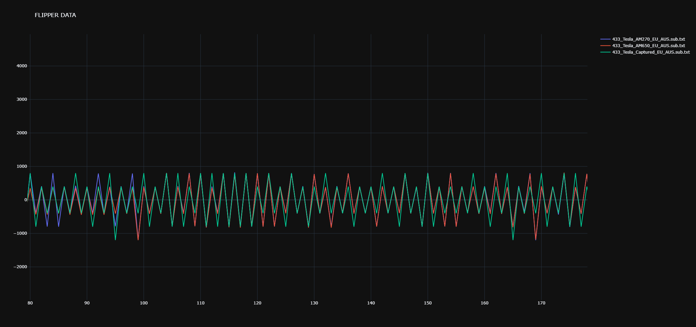
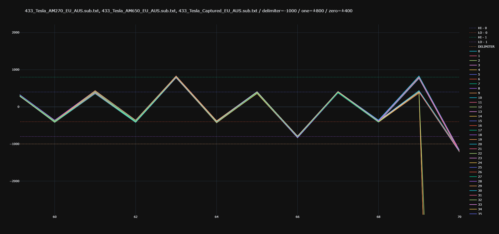

# Flipper SUB Plotters / comparers!
## (Special thanks to [@xb8](https://github.com/xb8))
#
## What is this?
We (me & xb8) were bored and decided to bruteforce some t119 devices (more about it [here](https://github.com/xb8/t119bruteforcer))

This repository basically contains the tools we used to plot and compare the flipper zero .sub files thus allowing us to identify the varying bits and make a bruteforcer out of it.

In this repository you will find two scripts:
- `plotall.py`
- `plot_delimiter.py`

The usage is described in the next chapter.

Requirements:
```bash
pip3 install -r requirements.txt
```
#
## plotall.py
```
usage: plotall.py [-h] [--outfile OUTFILE] fname [fname ...]

Flipper file plotter by ShotokanZH

positional arguments:
  fname              .sub file(s) to be plotted

optional arguments:
  -h, --help         show this help message and exit
  --outfile OUTFILE  Out file (.html), defaults to 'out.html'
```
Example:
```bash
python3 -BO plotall.py sample_files/433_Tesla_* --outfile out/out_plotall.html
```
Outputs:


#
## plot_delimiter.py
```
usage: plot_delimiter.py [-h] --delimiter DELIMITER [--zero ZERO] [--one ONE] [--outfile OUTFILE] fname [fname ...]

Flipper file plotter with delimiter by ShotokanZH

positional arguments:
  fname                 .sub file(s) to be plotted

optional arguments:
  -h, --help            show this help message and exit
  --delimiter DELIMITER
                        A specific delimiter (Y coordinates) that splits the sequence in chunks (a very low/high value?)
  --zero ZERO           Y coordinates, draws a line and defines values around it as 0 (it's fancy) (requires --one)
  --one ONE             Y coordinates, draws a line and defines values around it as 1 (it's fancy) (requires --zero)
  --outfile OUTFILE     Out file (.html), defaults to 'out.html'
```
Example:
```bash
python3 -BO plot_delimiter.py sample_files/433_Tesla_* --delimiter -1000 --one 800 --zero 400 --outfile out/out_plot_delimiter.html
```
Outputs (In console)
```
len(ylist)=5232 distance=70 maxnum=63
Sequence 0: 000011001111001111111111001001100100100001000010011001110000001001001
Sequence 1: 000011001111001111111111001001100100100001000010011001110000001001001
Sequence 2: 00001100111100111111111100100110010010000100001001100111000000100100
[ CLIP ]
Sequence 60: 000011001111001111111111001001100100100001000010011001110000001001001
Sequence 61: 000011001111001111111111001001100100100001000010011001110000001001001
Sequence 62: 000011001111001111111111001001100100100001000010011001110000001001000
```
Outputs (.html file)
